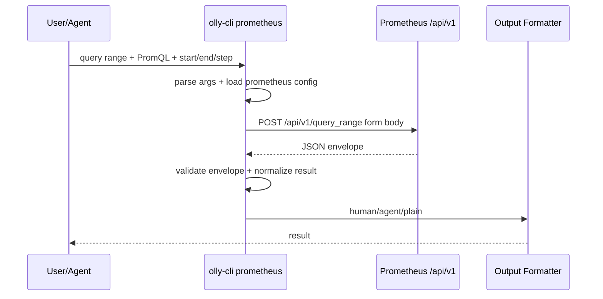

# Prometheus HTTP API 重构方案

## 目标

删除当前 `promtool` 外部进程包装，改为 olly-cli 内置 Prometheus HTTP API client。目标是让 `dist/olly-cli` 单文件可独立执行 Prometheus 查询，不依赖本机安装 `promtool`。

当前 `src/prometheus/promtool.ts` 的方向需要废弃：它通过 `Bun.which("promtool")` 和 `Bun.spawn(...)` 运行外部二进制，不利于打包和分发。

## 设计依据

Prometheus 官方 HTTP API 当前稳定入口在 `/api/v1`。表达式查询支持：

- `GET|POST /api/v1/query`: instant query。
- `GET|POST /api/v1/query_range`: range query。
- `GET|POST /api/v1/series`: series metadata。
- `GET|POST /api/v1/labels`: label names。
- `GET /api/v1/label/<label_name>/values`: label values。

官方响应统一为 JSON envelope：

```ts
interface PrometheusEnvelope<T> {
  status: "success" | "error";
  data?: T;
  errorType?: string;
  error?: string;
  warnings?: string[];
  infos?: string[];
}
```

错误语义：

- HTTP `400`: 参数缺失或错误。
- HTTP `422`: PromQL 表达式无法执行。
- HTTP `503`: 查询超时或被中止。
- 非 `2xx` 且不是 Prometheus JSON envelope 时，按 HTTP 错误处理。

## 命令形态

保留之前 `prom-cli` 的使用习惯，但不再对齐 `promtool` 参数体系。

```bash
olly-cli prometheus query instant [options] <promql>
olly-cli prometheus query range [options] <promql>
olly-cli prometheus query labels [options] [label_name]
olly-cli prometheus query series [options]
olly-cli prometheus ready
olly-cli prometheus build-info

olly-cli prom query range ...
```

`prom` 是 `prometheus` 的短别名。

### case

用户给定 case 应直接映射到 `/api/v1/query_range`：

```bash
olly-cli prometheus query range \
  --start='2026-04-22T10:00:00+08:00' \
  --end='2026-04-22T11:00:00+08:00' \
  --step=60s \
  '100 * (1 - node_memory_MemAvailable_bytes{job="node",instance="192.0.2.10"} /
    node_memory_MemTotal_bytes{job="node",instance="192.0.2.10"})'
```

HTTP 请求：

```text
POST http://127.0.0.1:9090/api/v1/query_range
Content-Type: application/x-www-form-urlencoded

query=100 * ...
start=2026-04-22T10:00:00+08:00
end=2026-04-22T11:00:00+08:00
step=60s
```

为什么使用 `POST`：PromQL 可能很长，且包含大量 `{}`、引号、正则、换行。统一用 `application/x-www-form-urlencoded` 可以避免 URL 长度和 shell 转义问题。

## 配置

扩展现有 `config.json`，新增可选 `prometheus` 段：

```json
{
  "prometheus": {
    "base_url": "http://127.0.0.1:9090",
    "default_step": "60s",
    "default_timeout": "30s"
  }
}
```

配置优先级：

```text
CLI flag > config.json > 内置默认值
```

字段说明：

- `base_url`: Prometheus server 地址，默认 `http://127.0.0.1:9090`。
- `default_step`: `query range` 默认 step。不指定时先用配置；配置也没有则要求显式传 `--step`。
- `default_timeout`: 查询超时参数，透传 Prometheus `timeout`。

命令级覆盖：

```bash
olly-cli prometheus --base-url http://127.0.0.1:9090 query instant up
olly-cli prometheus query range --timeout=60s --step=15s ...
```

## 参数设计

### `query instant`

```bash
olly-cli prometheus query instant [--time <rfc3339|unix>] [--timeout <duration>] [--limit <n>] <promql>
```

映射：

- endpoint: `/api/v1/query`
- params: `query`, `time`, `timeout`, `limit`

### `query range`

```bash
olly-cli prometheus query range --start <time> --end <time> --step <duration|seconds> [--timeout <duration>] [--limit <n>] <promql>
```

映射：

- endpoint: `/api/v1/query_range`
- params: `query`, `start`, `end`, `step`, `timeout`, `limit`

约束：

- `--start` 必填。
- `--end` 必填。
- `--step` 必填，除非配置了 `prometheus.default_step`。
- `<promql>` 必填，允许包含换行。

### `query labels`

兼容旧习惯：

```bash
olly-cli prometheus query labels
olly-cli prometheus query labels __name__
olly-cli prometheus query labels job --match='up'
```

映射：

- 无 `label_name`: `/api/v1/labels`
- 有 `label_name`: `/api/v1/label/<label_name>/values`
- 支持 `--match` 重复传入，映射为 `match[]`
- 支持 `--start`、`--end`、`--limit`

### `query series`

```bash
olly-cli prometheus query series --match='up' [--match='process_start_time_seconds{job="prometheus"}'] [--start <time>] [--end <time>] [--limit <n>]
```

映射：

- endpoint: `/api/v1/series`
- params: repeated `match[]`, `start`, `end`, `limit`

约束：

- 至少一个 `--match`。

### 状态命令

```bash
olly-cli prometheus ready
olly-cli prometheus healthy
olly-cli prometheus build-info
olly-cli prometheus runtime-info
```

映射：

- `ready`: `/-/ready`
- `healthy`: `/-/healthy`
- `build-info`: `/api/v1/status/buildinfo`
- `runtime-info`: `/api/v1/status/runtimeinfo`

## 输出模式

复用现有全局 `--output human|agent|plain`。

### `plain`

输出 Prometheus 原始 JSON envelope，便于调试和与官方 API 对齐。

### `human`

面向终端阅读：

- `query instant`: 展示 metric labels 和当前 value。
- `query range`: 每条 series 展示 labels、点数、首尾时间、首尾值、min/max/avg。
- `labels`: 每行一个 label name/value。
- `series`: 每行一个 label set，格式接近 `{job="node",instance="..."}`。
- warnings/infos 输出到 stderr。

### `agent`

面向 LLM：

- 保留 query、time range、step、resultType。
- 对 range matrix 计算 summary：series_count、sample_count、min、max、avg、first、last。
- 对每条 series 输出 labels 和 compact values 摘要，不默认倾倒所有点，避免上下文爆炸。
- 如果用户显式加 `--include-values`，agent 输出才包含完整 values。

## 数据流



## 文件结构

删除：

- `src/prometheus/promtool.ts`

新增：

- `src/prometheus/types.ts`: Prometheus config、API envelope、query result 类型。
- `src/prometheus/query.ts`: request builder，纯函数，负责 endpoint 和 URLSearchParams。
- `src/prometheus/api.ts`: fetch client，负责 HTTP、JSON envelope 校验、错误转换。
- `src/prometheus/format.ts`: human/agent/plain 输出。

修改：

- `src/cli.ts`: 将 `prometheus/prom` 分支接到 HTTP client，不再 `spawn`。
- `src/help.ts`: 更新 Prometheus 命令说明。
- `src/uptrace/config.ts`: `AppConfig` 增加可选 `prometheus` 配置；保留 Uptrace 校验规则，但 Prometheus 命令不能强制要求 Uptrace 配置存在。
- `completions/olly-cli.fish`: 补全 Prometheus HTTP API 子命令和 flags。
- `spec.md`: 删除 promtool 包装描述，引用本文件作为 Prometheus 子规格。

## 测试策略

按现有 Bun 测试风格，先写失败测试再实现。

新增 `tests/prometheus.test.ts`：

- 构造 `query_range` POST request：路径、method、form body、长 PromQL、`+08:00` 时间必须正确保留。
- 构造 `query` instant request。
- 构造 `labels` 和 label values request。
- 构造 repeated `match[]` 的 `series` request。
- Prometheus `status=error` 时抛出包含 `errorType` 和 `error` 的错误。
- `plain` 输出保留原始 envelope。
- `agent` range 输出包含 series_count、sample_count、min/max/avg、first/last。
- Prometheus 命令不要求存在 Uptrace 配置。

保留现有 Uptrace 测试，删除旧 promtool 参数重写测试。

验证命令：

```bash
bun run check
bun run build
```

## 不做

- 不调用 `promtool`。
- 不依赖外部二进制。
- 不实现 Prometheus admin/delete API。
- 不内置鉴权逻辑，除非后续配置明确需要。
- 不做降级路径: 请求失败, 配置错误, 参数错误都直接失败并输出明确错误。

## 实施顺序

1. 删除 `src/prometheus/promtool.ts` 的使用点和旧测试。
2. 新增 Prometheus 类型与 request builder，先让 request builder 测试变红再实现。
3. 新增 API client，覆盖 envelope 成功/失败分支。
4. 接入 `src/cli.ts`，确保 Prometheus 命令不读取 Uptrace 必填配置。
5. 更新 formatter、help、completion、`spec.md`。
6. 跑 `bun run check` 和 `bun run build`。

## 参考

- Prometheus HTTP API: https://prometheus.io/docs/prometheus/3.2/querying/api/
