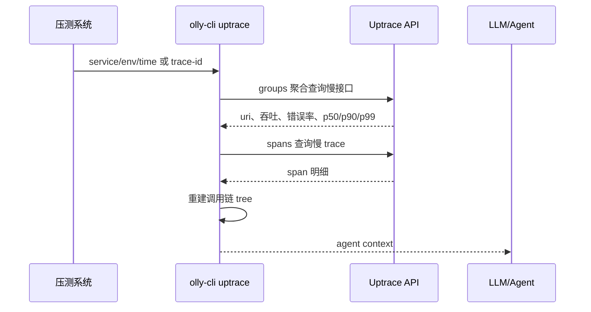

# olly-cli spec

## 目标

实现一个给人类和 `Agent` 使用的全链路检测查询工具。v1 先实现 `uptrace` 和 `prometheus`：

- `uptrace`: 用于把压测系统里的“某个接口慢了”拼成 LLM 可直接分析的上下文。
- `prometheus`: 直接封装 Prometheus HTTP API，支持单文件打包，不依赖 `promtool`。



## 技术栈

- Runtime: `bun`
- Language: `typescript`
- Test: `bun test`

## 输出模式

- `human`: 默认，人类可读，摘要 + 调用链 + 链接。
- `agent`: 给 LLM 读，去掉无关装饰，保留 trace tree、耗时、错误、关键 attributes、源码定位线索。
- `plain`: 原始 JSON，主要用于确认 Uptrace 返回内容。

## 配置

配置优先级：

```text
olly-cli -f config.json > ~/.config/olly-cli/config.json
```

配置格式：

```json
{
  "uptrace": {
    "base_url": "https://uptrace.example.com",
    "web_base_url": "https://uptrace.example.com",
    "project_id": 2,
    "auth_token": "user-auth-token",
    "jwt_token": "browser-jwt-token",
    "default_env": "loadtest",
    "default_time_dur_seconds": 10800
  },
  "prometheus": {
    "base_url": "http://127.0.0.1:9090",
    "default_step": "60s",
    "default_timeout": "30s"
  },
  "graylog": {
    "base_url": "127.0.0.1:9000",
    "username": "admin",
    "password": "admin"
  }
}
```

说明：

- `base_url`: Uptrace JSON API 地址。
- `web_base_url`: 生成浏览器链接使用；不配置时使用 `base_url`。
- `project_id`: Uptrace project id，示例环境常用 `2`。
- `auth_token`: Uptrace user authentication token，走 `Authorization: Bearer <auth_token>`。
- `jwt_token`: 浏览器登录态 JWT，走 `Cookie: token=<jwt_token>`。`auth_token` 和 `jwt_token` 二选一即可；同时配置时优先使用 `jwt_token`。
- `default_env`: 默认环境，压测默认 `loadtest`。
- `default_time_dur_seconds`: 默认查询窗口，压测默认 `10800` 秒。
- `prometheus.base_url`: Prometheus HTTP API 地址，默认 `http://127.0.0.1:9090`。
- `prometheus.default_step`: `query range` 默认 step。
- `prometheus.default_timeout`: Prometheus 查询超时参数。

## Commands

整体格式：

```bash
olly-cli [-f config.json] [--output human|agent|plain] uptrace {groups|spans|trace|context|diagnose}
olly-cli [-f config.json] [--output human|agent|plain] logs <query-or-graylog-url>
olly-cli [-f config.json] [--output human|agent|plain] logs aggregate --field <field> --query <query>
olly-cli [-f config.json] [--output human|agent|plain] graylog <query-or-graylog-url>
olly-cli [-f config.json] [--output human|agent|plain] prometheus {query|ready|healthy|build-info|runtime-info}
olly-cli [-f config.json] [--output human|agent|plain] prom {query|ready|healthy|build-info|runtime-info}
```

### `logs`

对应 Graylog API `/api/search/universal/{relative|absolute|keyword}`，用于从业务日志中按 query 查询错误。默认输出日志列表；传 `--group-by <field>` 时按任意 message 字段分组，例如 `logger_name`、`source`、`trace_id`。`agent` 输出会保留 `trace_id` 和 logger 摘要，后续可继续交给 `olly-cli uptrace context|trace` 分析调用链。

示例：

```bash
olly-cli --output agent logs 'app:billing AND level:3' --relative 28800 --limit 50
```

按 logger 分组：

```bash
olly-cli --output agent logs 'app:billing AND level:3' --relative 28800 --group-by logger_name
```

查看当前 query 返回中可用于统计的字段：

```bash
olly-cli logs --query 'app:billing AND level:3' --show-fields
```

服务端 count 聚合, 对齐 Graylog 页面里的 `Aggregating count() by <field>`：

```bash
olly-cli logs aggregate --query 'app:billing AND level:3' --relative 28800 --field USER_IP --limit 10
```

拿到 key 后反查明细：

```bash
olly-cli logs --query 'app:billing AND level:3 AND USER_IP:220.181.51.116' --relative 28800 --limit 20
```

绝对时间：

```bash
olly-cli logs 'app:billing AND level:3' \
  --from '2026-06-01T10:00:00+08:00' \
  --to '2026-06-01T11:00:00+08:00'
```

也支持直接粘贴 Graylog 页面链接：

```bash
olly-cli logs 'https://log.example.com/search?q=app%3Abilling+AND+level%3A3&rangetype=relative&relative=28800'
```

支持参数：

- `--query`: Graylog query；不传时读取第一个位置参数。
- `--relative`: 相对时间窗口秒数；URL 输入会优先读取链接里的 `relative`，默认 `28800`。
- `--from`: 绝对时间起点；和 `--to` 一起使用时走 `absolute` 查询。
- `--to`: 绝对时间终点。
- `--keyword`: Graylog keyword 时间窗口；传入时走 `keyword` 查询。
- `--limit`: 返回日志条数，默认 `50`。
- `--offset`: 分页 offset。
- `--sort`: 排序表达式，默认 `timestamp:desc`。
- `--fields`: 返回字段列表，逗号分隔。
- `--filter`: Graylog filter，例如 `streams:<id>`。
- `--decorate`: 透传 Graylog decorate。
- `--group-by`: 按任意 message 字段对返回日志分组；不传时不分组。
- `--show-fields`: 打印当前 query 返回中的字段；`agent` 模式额外输出建议 group-by 字段。
- `logs aggregate --field`: 走 Graylog `/views/search/sync` 服务端 pivot 聚合，只输出 key/count；这才是全量聚合语义。

## 本地安装和 Fish 集成

本地构建、验证、安装都走 `Justfile`：

```bash
just check
just build
just install
```

`just install` 会：

- 构建 `dist/olly-cli`
- 安装二进制到 `~/.local/bin/olly-cli`
- 安装 Fish completion 到 `~/.config/fish/completions/olly-cli.fish`

Fish 首次集成：

```fish
set -Ua fish_user_paths "$HOME/.local/bin"
olly-cli --help
```

也可以直接查看命令：

```bash
just fish-setup
just doctor
```

### `uptrace groups`

对应 Uptrace 内部 API `/internal/v1/tracing/{project_id}/groups`，用于聚合查询慢接口。

示例：

```bash
olly-cli uptrace groups \
  --service app-gw \
  --env loadtest \
  --time-gte 20260429T060000 \
  --time-dur 10800 \
  --limit 100
```

默认 UQL：

```text
group by _group_id | per_min(sum(_count)) | _error_rate | {p50,p90,p99}(_duration) | where deployment_environment = "loadtest" | where service_name = "app-gw"
```

也可以直接指定原始 UQL：

```bash
olly-cli uptrace groups --query 'group by _group_id | per_min(sum(_count))'
```

### `uptrace group-stats`

对应 Uptrace 内部 API `/internal/v1/tracing/{project_id}/group-stats`，用于按当前 UQL 取固定指标列：

- `per_min(sum(_count))`
- `_error_rate`
- `p50(_duration)`
- `p90(_duration)`
- `p99(_duration)`

示例：

```bash
olly-cli uptrace group-stats \
  --service ld-dt-gateway \
  --env loadtest \
  --query 'group by _system | per_min(sum(_count)) | _error_rate | {p50,p90,p99}(_duration) | max(_duration) | where deployment_environment = "loadtest" | where service_name = "ld-dt-gateway" | where _system = "httpserver:ld-dt-gateway"'
```

### `uptrace spans`

对应 Uptrace 内部 API `/internal/v1/tracing/{project_id}/spans`，用于查询 span 明细。

示例：

```bash
olly-cli uptrace spans \
  --trace-id e4f1e0bcd6a1ac296661a3e6ea5507c9 \
  --time-gte 20260429T060000 \
  --time-dur 10800 \
  --output plain
```

支持参数：

- `--trace-id`
- `--span-id`
- `--parent-id`
- `--duration-gte`
- `--duration-lt`
- `--limit`
- `--time-start`
- `--time-end`
- `--time-gte`
- `--time-lt`
- `--time-dur`
- `--query`
- `--sort-by`
- `--sort-desc`
- `--page`

### `uptrace trace`

输入 trace-id 或 Uptrace trace URL，自动解析 trace id，通过内部 API `/internal/v1/tracing/{project_id}/traces/{trace_id}` 拉取完整调用链。

示例：

```bash
olly-cli uptrace trace https://uptrace.example.com/traces/2/e4f1e0bcd6a1ac296661a3e6ea5507c9
```

支持输入：

- 裸 trace id：`e4f1e0bcd6a1ac296661a3e6ea5507c9`
- Uptrace URL：`https://uptrace.example.com/traces/2/e4f1e0bcd6a1ac296661a3e6ea5507c9`
- 日志片段：`trace_id=e4f1e0bcd6a1ac296661a3e6ea5507c9 cost=1200ms`

### `uptrace context`

面向 LLM 的上下文导出，默认推荐使用 `--output agent`。

示例：

```bash
olly-cli --output agent uptrace context e4f1e0bcd6a1ac296661a3e6ea5507c9 \
  --service app-gw \
  --env loadtest \
  --uri /api/order
```

输出包含：

- trace id、project id、Uptrace 页面链接
- 查询条件
- span 总数、错误 span 数、总耗时
- top slow spans
- parent-child 调用链
- source hints：`service_name`、`http_route`、`rpc_method`、`peer_service`、`db_statement`

### `uptrace diagnose`

一键排查入口。v1 先执行 groups 聚合查询，输出候选慢接口；后续版本再串联慢 trace 自动选择。

示例：

```bash
olly-cli uptrace diagnose --service app-gw --env loadtest
```

### `prometheus`

`prometheus` 直接调用 Prometheus HTTP API，默认 endpoint：

```text
http://127.0.0.1:9090
```

示例：

```bash
olly-cli prometheus query labels __name__
olly-cli prometheus query labels job --match='up'
olly-cli prometheus query instant 'up{job="prometheus"}'
olly-cli prometheus query series --match='up' | jq -r '.[].job'
olly-cli prometheus query range --start='2026-04-22T00:00:00+08:00' --end='2026-04-22T01:00:00+08:00' --step=60s 'up'
olly-cli prometheus ready
olly-cli prometheus build-info
```

HTTP API 映射：

- `query instant`: `POST /api/v1/query`。
- `query range`: `POST /api/v1/query_range`。
- `query labels`: `POST /api/v1/labels` 或 `POST /api/v1/label/<label_name>/values`。
- `query series`: `POST /api/v1/series`。
- `ready`: `GET /-/ready`。
- `healthy`: `GET /-/healthy`。
- `build-info`: `GET /api/v1/status/buildinfo`。
- `runtime-info`: `GET /api/v1/status/runtimeinfo`。

更详细的 Prometheus 子规格见 `prom-spec.md`。

## Uptrace v1 能力边界

- 已实现：
  - trace-id 自动解析。
  - groups 请求构造。
  - spans 请求构造。
  - trace 调用链重建。
  - human / agent / plain 输出。
  - LLM context 导出。
  - Prometheus HTTP API 查询。

- 不做：
  - 不实现 Graylog。
  - 不依赖或调用 `promtool`。
  - 不用 username/password 登录 Uptrace。
  - 不内置本地源码搜索；CLI 只输出足够 Agent 搜代码的 source hints。
